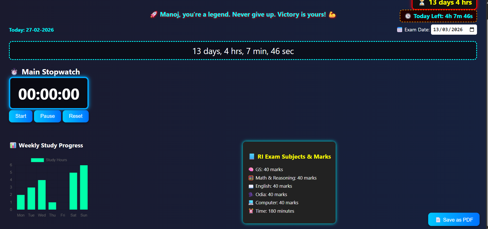

# exam-tracker-web
## 📚 Daily Study Timer (Govt Exam Preparation)

This project is a study timer website designed for government exam preparation.

### ✅ Features
- Stopwatch (Start / Pause / Reset)
- Exam countdown timer
- Weekly study progress chart
- Exam subjects & marks section
- Save data using LocalStorage
- Export as PDF option

### 🛠 Tech Used
- HTML
- CSS
- JavaScript
- LocalStorage

### 🚀 Future Improvements
- Add multiple subject tracking
- Add login system
- Mobile responsive design
- Cloud data storage

### 🎯 Purpose
Helps track daily study time and exam preparation progress.

### 👨‍💻 Author
Manoj Kumar Jena
